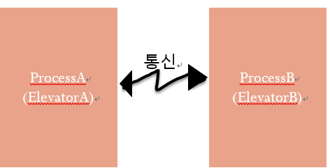
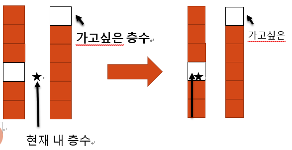
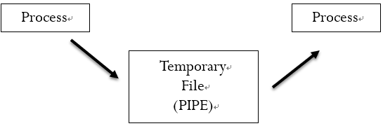
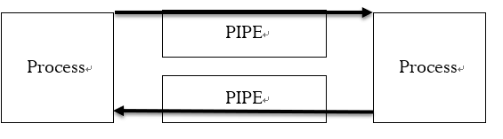
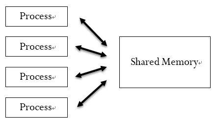

Sharedmemory-simulation_Elevator
===
### Date: 2016-12~
#### university programming assignments.
-------------
## 개요
우리는 엘리베이터를 실생활 속에서 많이 이용한다. 특히 고층 건물이나 인적이 많은 건물에서는 엘리베이터를 2개 이상을 설치한다. 하지만 엘리베이터가 많다고 해서 바쁠 때나 급할 때 효율적인 엘리베이터가 되지 못한다. 예를 들어 대부분의 사람들은 엘리베이터가 2개가 있으면 2개의 엘리베이터를 호출할 것이다. 이 문제는 전력 소비량이 크고 효율적이지 못한 엘리베이터이다. 그래서 고안한 방법이 스마트 엘리베이터다. 이 스마트 엘리베이터는 현재 층에서 몇 층이 목적지인지 누르면 그 층에서 제일 가까운 멈춰있던 엘리베이터가 오게 되는 방법이다. 이는 시간 단축과 효율적인 전력 소비도 할 수 있게 된다.

## 예상 시나리오
1층부터 10층까지의 건물이 있다. 현재 4층에서 7층으로 가겠다는 사람이 버튼을 누른다. 그러면 두개의 엘리베이터중 제일 가까운 1층에 멈춰 있던 엘리베이터가 4층으로 가서 7층으로 간다. 현재 9층에서 2층으로 가겠다는 사람이 버튼을 누른다. 그러면 두개의 엘리베이터중 제일 가까운 10층에 멈춰 있던 엘리베이터가 9층으로 가서 2층으로 간다.

## 구현 계획
1층부터 10층까지의 건물로 생각. 각 2개의 엘리베이터가 존재한다. 이 2개의 엘리베이터는 각 프로세스로 생각하고 프로세스 통신 기법을 이용하여 프로세스 서로간 통신한다.

입력 값은 현재 내 층수, 내가 갈 위치를 입력 받는다. 현재 내 위치가 2층이고 갈 위치가 8층이라 할 때 2 8을 입력한다. 만약 종료하고 싶다면 -1을 입력한다.
입력 2 8이 들어왔을 때 프로세스끼리 통신을 하며 제일 가까운 프로세스가 옮겨진다. 제일 가까운 프로세스 판단 알고리즘은 (현재 층수 – 엘리베이터 층수) 계산하고 이 값을 절대값으로 계산하고 ProcessA, ProcessB 값을 비교하면 숫자가 낮은 수가 제일 가깝다고 판단한다.

## 예
6층짜리 건물
엘리베이터A 층수 1, 엘리베이터B 층수 5
현재 층수(★) 3, 내가 가고 싶은 층수 5

# PIPE 기법
여러 개의 프로세스가 공통으로 사용하는 임시 공간이라고 할 수 있다. 그리고 그 임시 공간은 실제로 파일 시스템에 생성되는 임시 파일이다. 하나의 프로세스가 파이프에 쓰게 되면 다른 프로세스는 그 파이프에서 읽는 방식으로 쓰게 된다.

위에 그림처럼 파이프는 시스템 내부에서 관리하는 임시 파일을 이용하므로, 다른 IPC 기법 중 하나인 SIGNAL 과는 다르게 대용량의 메시지도 전송이 가능하다.

양방향 파이프 통신에서는 파이프를 두개 생성하여 하나의 방향으로만 갈 수 있도록 한다.

# Shared Memory 기법
공유메모리란 여러 장치(주로 CPU)가 공동으로 사용하는 메모리, 혹은 여러 개의 프로세스가 공통으로 사용하는 메모리를 의미한다.

IPC 기법중에서 메모리 자체를 공유하므로 데이터 복사와 같은, 불필요한 오버헤드가 발생하지 않기 때문에 공유 메모리는 처리속도가 가장 빠르다. 반면 공유 메모리는 반드시 같은 기계에서만 사용가능 하다는 단점도 있다. 또 같은 메모리를 사용하는 만큼 데이터 불일치 문제를 해결해주어야 한다는 이슈도 있다.
공유 메모리의 생성: shmget
공유할 메모리 영역 생성한다.
공유 메모리 연산: shmat
공유메모리를 프로세스 주소 공간에 연결한다.
공유 메모리 해제: shmdt
공유 메모리를 해제한다.
공유 메모리 제어: shmctl
공유 메모리 제거한다.

